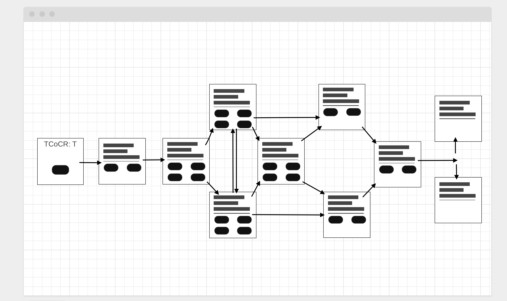

# Game Details
<!-- Title of The Game -->
 The Chronicles of Sister Rosewyne: The Wards of Tideport
<!-- A Narrative Game By Kiraah Grandberry -->

## Overview
'The Chronicles of Sister Rosewyne: The Wards of Tideport' is a narrative/choose your own adventure game following a Cleric of the Goddess oft caled The Lady Of The Water. She has been summoned to the island after a particularly bad storm to renew the wards of the local Vessel and those surrounding the borders of the remote town of Tideport. Of course, nothing is ever so simple as it would seem in a world where the ancient magics of old are creeping more and more into the mundane world. 

## User Story
- The user clicks one of the buttons on the start screen
- They are given some flavor text to set the mood, some background on the setting, and are introduced to the protagonist
- The player will travel throught the town and the market before finally getting to the Wards
- The players score will be added to as they answer the riddles throughout the various levels and are exposed to more description of the Wards
- After all of this the player will confront the creature in the Vessel of Tideport and then be taken to a screen showing their score in relation to how well they were able to answer the riddles and re-seal the Wards
- The game will then reset itself after giving the player some time to see their score and read the closing text
